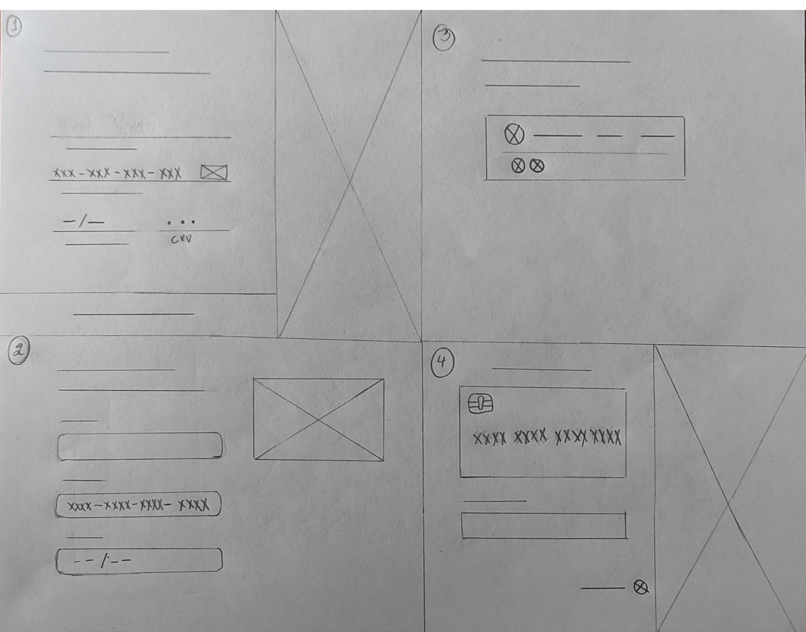
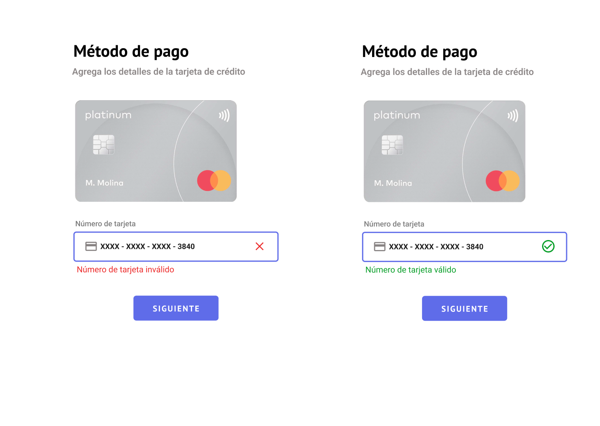
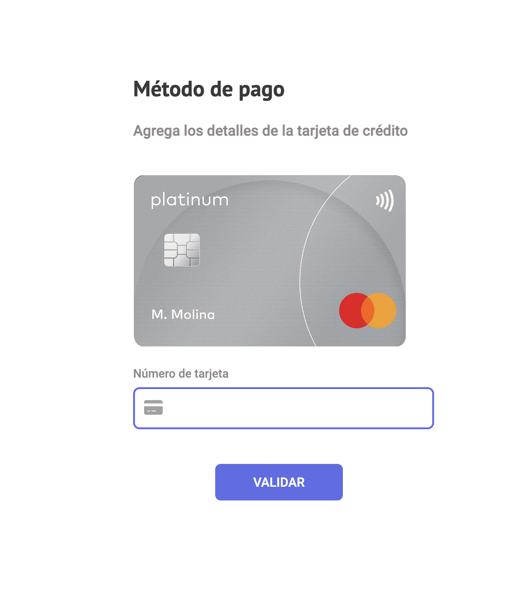
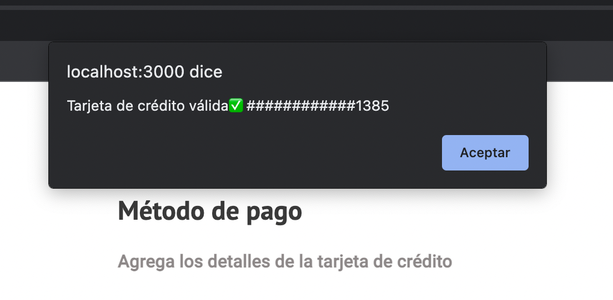
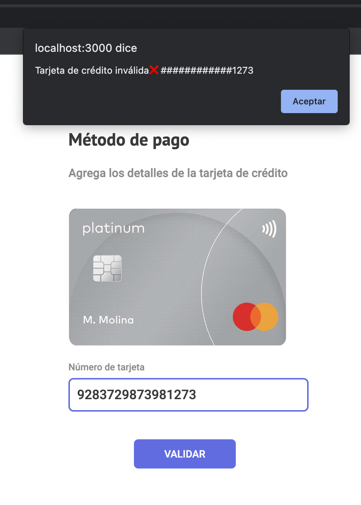
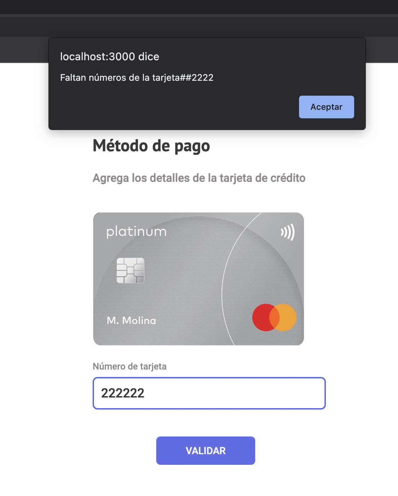

# _Card validator para una tienda online_

El siguiente proyecto será creado para validar las tarjetas crédito de una tienda online a la hora en que los clientes efectuen el pago.

## ¿Quiénes son los principales usuarios del producto?

Clara es una dueña de una tienda de ropa deportiva online. Los compradores de su tienda (usuarios) tienen problemas a la hora de efectuar el pago de sus pedidos, justo al momento de validar los datos de la tarjeta de crédito.

## ¿Cuáles son los objetivos de estos usuarios en relación con tu producto?

> "Como comprador de una tienda online quiero validar que los datos que ingrese a la hora de pagar por el producto que deseo estén correctos de manera rápida y eficaz sin tardar tanto en el proceso"

## ¿Cómo crees que el producto que estás creando está resolviendo sus problemas?

Los usuarios no tendrán inconvenientes a la hora de añadir los datos de sus tarjetas de crédito, ya que serán verificadas de manera rápida al momento en que el usuario la esté ingresando.

Se mostrará un mensaje "Número de tarjeta válido" de haber ingresado los datos correctos o "Número de tarjeta inválido" de existir algún error pudiendo modificar el número y asi agilizando la compra.

# Wireframes de baja y alta fidelidad.

## 1. Prototipo de baja fidelidad

A continuación se presentan 4 prototipos de baja fidelidad hechos en papel y a mano, se tomó el feedback correspodiente y se realizaron modificaciones para ser mostradas en el prototipo de alta fidelidad.

## 2. Prototipo de alta fidelidad

En este prototipo de alta fidelidad podemos ver las modificaciones finales y detalles estéticos,como son los colores, tipo de letra y mensajes que podrá observar el usuario al momento de validar su tarjeta.

## 2. Versión terminada y funcional del prototipo

La versión final del prototipo creada con HTML, CCS y javaScript. Se mantuvo fiel al diseño inicial, sin embargo se cambió la forma en como aparece "tarjeta válida" y "tarjeta inválida" por un alert, también puede ser visible la funcionalidad de maskify.

## Tarjeta de crédito válida

Muestra un alert con el mensaje de "tarjeta de crédito válida" y los números de la tarjeta ocultos.

## Tarjeta de crédito inválida

Muestra un alert con el mensaje de "tarjeta de crédito inválida" y los números de la tarjeta ocultos.

## Tarjeta de crédito incompleta

Muestra un alert con el mensaje de "Faltan números de la tarjeta" y los números de la tarjeta ocultos.

